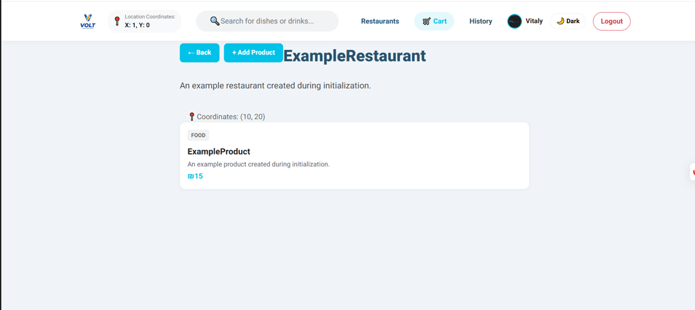
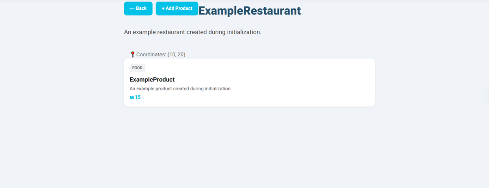
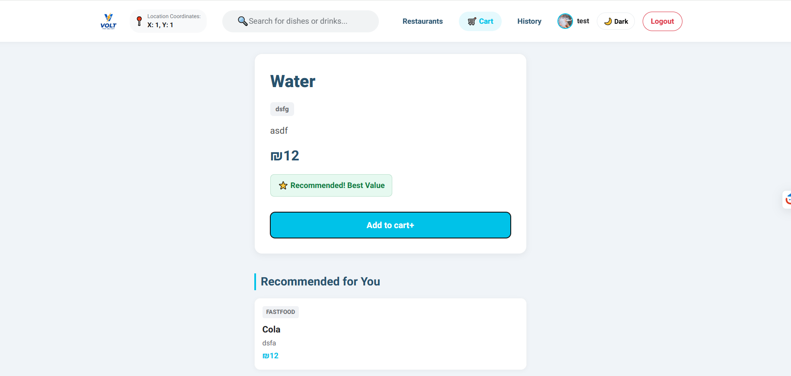
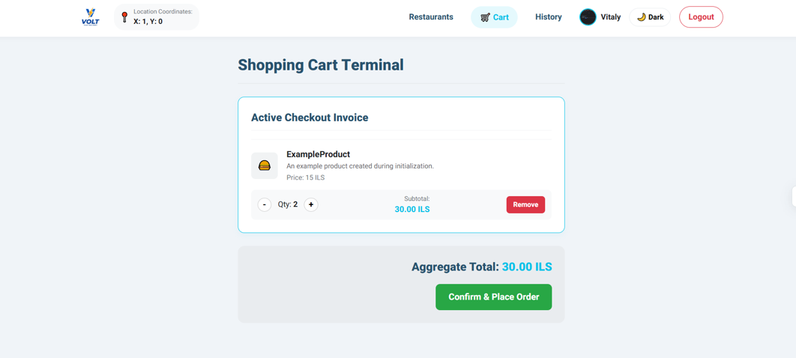
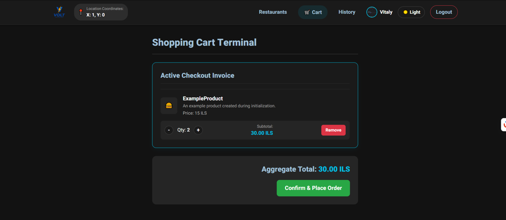
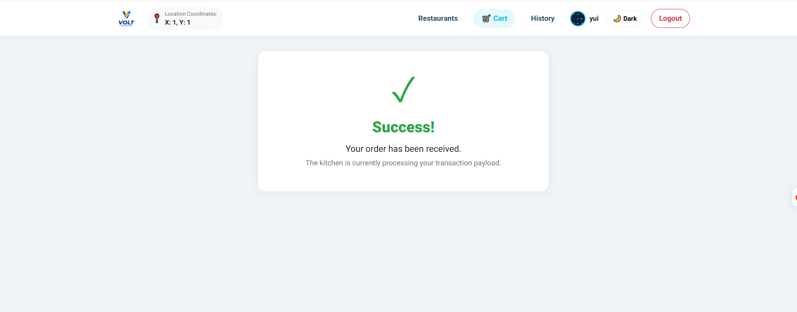

# Project_ASP
This is a repoitory for the fifth sprint in the project in course Advanced System Programming  

## Build and run app instruction
1) **Launch Services:** Run `docker-compose up --build`
2) **Run App:** Open **Expo Go** on the emulator and enter:
   `exp://10.0.2.2:8081`
## Workflow 
- As you may understand we've already written cpp backend engine and node js api
- So now we implement frontend to our app
- We planned all ux flow in file [Work convention flow](./Work_convention_flow.md)
- Then we split it between us as written in this file [UX flow](./UX%20flow.md)
- We have started with basics like docker, connection between all stages, registration and login page 

## Screenshots 
1) 
2) 
3) 
4) 
5) 
6) 
7) 
8) 

