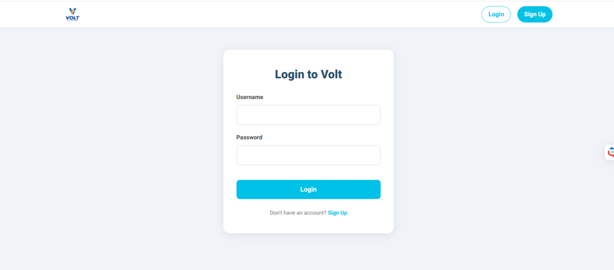
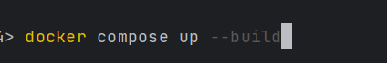
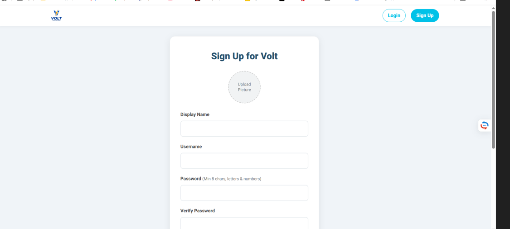
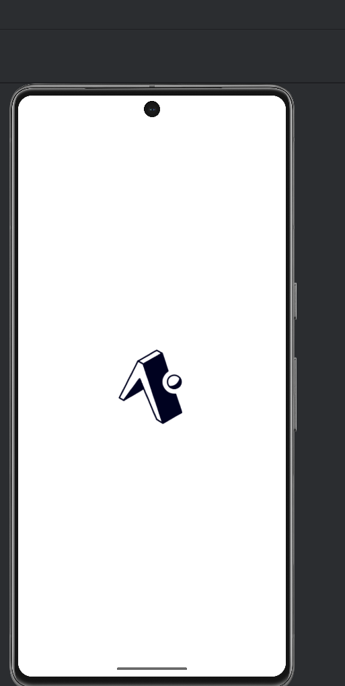
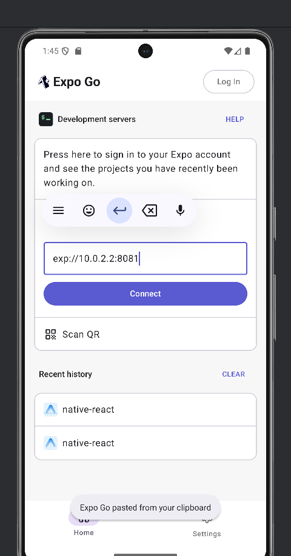
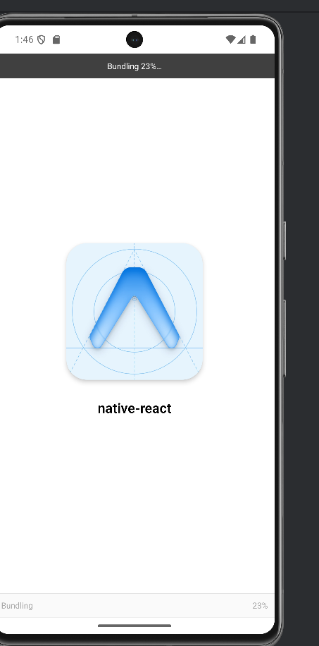

# Project_ASP
This is a repository for the fifth sprint in the project in course Advanced System Programming  

## Build and run app instruction 
### Be patient, it may take a little time
_Anyway it's better than download AndroidStudio into the docker container, in order to ~~explode your RAM~~_

_Honestly that's what I want to do, cause initially we have no clue how you're going to run it_
#### Eventually assuming that you have android emulator follow this instructions
1) **Launch Services:** Run `docker-compose up --build`.
2) When the previous step will be done and all images will be created go to the nex step 
3) **Run App:** Open **Expo Go** on the emulator and enter:
   `exp://10.0.2.2:8081` 
4) Then the process of the bundling will start.
5) When the bundling will be accomplished you will see the base screen and can use the app  
6) In case if it wasn't explicit enough check [Screenshots](#screenshots-) section

## Workflow 
- As you may understand we've already written cpp backend engine and node js api
- We have changed node_js api in order to write down some data into the database
- We integrated recommendation for every user from the second sprint - cpp backend engine
- Then i spent some time (just a little) trying to set up docker files, docker-compose and understand how you're going to check it
- My eyes are blowing up, btw 
- We implemented a migration from `react` to `react native`
- Hoping your eyes won't blow up

## Screenshots
1) 
2) 
3) 
4) 
5) 
6) 

